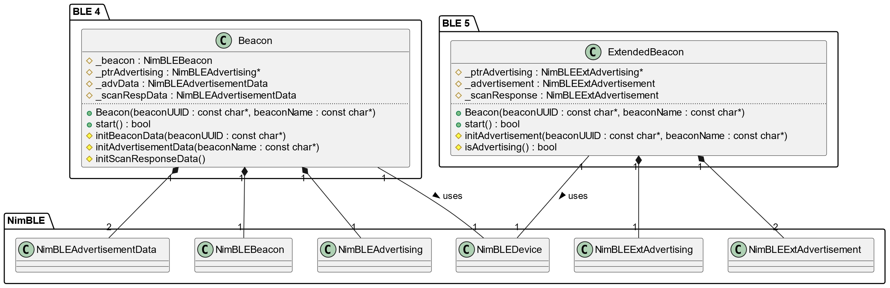

# Bluetooth Low Energy beacons based on ESP32 boards

## Description

This repository houses the code for programming the BLE (Bluetooth Low Energy) beacons used in the following Master Thesis: https://openaccess.uoc.edu/handle/10609/150532?locale=en.

The Master Thesis showcases the development of a prototype for an indoor positioning system using state-of-the-art techniques and BLE as RF technology.

The code is split in two different projects:

- **beacon**: Program for ESP32 boards with BLE 4.2
- **extended_beacon**: Program for ESP32-C3 boards with BLE 5.0

The Master Thesis is already submitted and finalized. Contributions are welcome: refactorings, improvements, extensions, etc.

## Table of Contents

- [Requirements](#requirements)
- [Setup](#setup)
- [Overview](#overview)

## Requirements

- IDE: [Visual Studio Code](https://code.visualstudio.com/)
- Plugin for embedded: [PlatformIO](https://platformio.org/install/ide?install=vscode)
- C++ support
- Arduino SDK and NimBLE library dependencies (managed by PlatformIO)

## Setup

Both folders (*beacon* and *extended_beacon*) contain an independent PlatformIO project.

1. Open the folder of interest with Visual Studio Code.
2. Let PlatformIO set up the configuration automatically.

## Overview

The implementation in both projects is based on the following class diagram:

Both projects make use of the NimBLE library (C++ wrapping of the Apache version for Arduino).
The NimBLE class Beacon is used to implement the protocol iBeacon in the BLE 4.2 devices (project *beacon*).
Whereas, the BLE 5.0 devices use the part of the NimBLE library that implements the BLE 5 extended advertisement modes (project *extended_beacon*).
This way BLE 5.0 boards can leverage the greater transmission power and configurable transmission channels.

Nevertheless, the BLE 5.0 devices operate in legacy mode (compatible with 4.2) so that only the classical advertisement channels are used: 37, 38, and 39.

To build and burn the image into a board (using PlatformIO) in any of the projects, the following hardcoded values (macros) can be tailored to your application:

| Macro | Suggested value  | Project | Description |
|:-:|:-:|:-:|:--|
| ADV_MAX_INTERVAL | 160U  | both | 100 ms of maximum advertisement interval |
| ADV_MIN_INTERVAL | 144U  | both | 90 ms of minimum advertisement interval |
| BEACON_UUID | "00000000-0000-0000-0000-000000000001" | both | iBeacon UUID (bytes 9th to 24th in the iBeacon protocol header) |
| BEACON_NAME | "Beacon 1" | both | device name (seen in advertisement packets) |
| TX_POWER | 18 | *extended_beacon* | transmission power (BLE 5.0 standard) |
| CHANNEL_37 | true | *extended_beacon* | enable advertising in channel 37 of Bluetooth |
| CHANNEL_38 | true | *extended_beacon* | enable advertising in channel 38 of Bluetooth |
| CHANNEL_39 | true | *extended_beacon* | enable advertising in channel 39 of Bluetooth |

NOTE: in the project *extended_beacon* there is a hardcoded Bluetooth address ("BE:BE:CA:FE:00:02"). This one will need to be unique if multiple BLE 5.0 devices are planned to be deployed. This is not an issue in the project *beacon* since the address is generated randomly.
